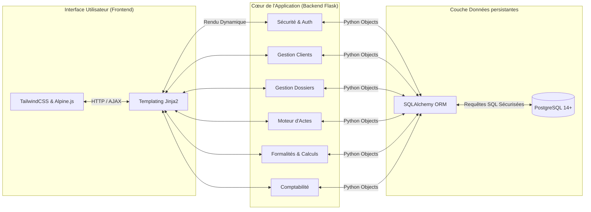
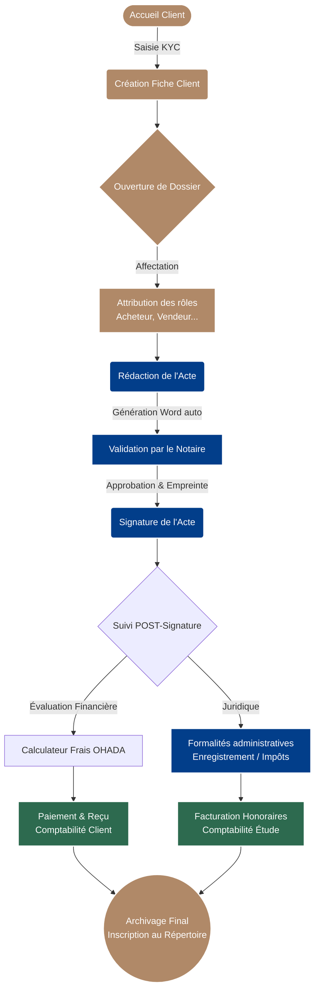

# 🏛️ AGEN-OHADA : Application de Gestion d'Études Notariales

**AGEN-OHADA** est une solution logicielle sur-mesure, moderne et sécurisée, conçue spécifiquement pour répondre aux exigences des études notariales opérant dans l'espace juridique **OHADA** (Organisation pour l'Harmonisation en Afrique du Droit des Affaires).

L'application centralise et automatise l'ensemble du cycle de vie d'une affaire notariale : de l'accueil du client à l'archivage final de l'acte, en passant par la rédaction, le calcul des droits d'enregistrement et la comptabilité stricte de l'étude.

---

## 🏗️ Architecture Technique

AGEN repose sur des fondations techniques robustes, garantissant sécurité, rapidité et maintenabilité. L'architecture suit le modèle MVC (Modèle-Vue-Contrôleur) avec une stricte séparation des responsabilités (Blueprint Pattern).

### Stack Technique Détaillée :
*   **Backend** : Python 3, Framework Flask 3.x.
*   **Base de données** : PostgreSQL avec SQLAlchemy (ORM) et Alembic pour les migrations.
*   **Frontend** : HTML5, TailwindCSS (pour un design moderne et totalement responsive), Alpine.js (pour l'interactivité).
*   **Génération de Documents** : Publipostage avancé sur modèles `.docx` (Microsoft Word) et Markdown.

---

## ✨ Fonctionnalités Principales (Modules)

L'application est divisée en 6 modules intégrés qui communiquent intelligemment entre eux.

### 👥 1. Gestion des Clients (Module KYC)
*   **Centralisation** : Enregistrement des personnes physiques et morales.
*   **KYC (Know Your Customer)** : Suivi de la complétude du dossier client (PIèce d'identité, justificatifs de domicile, profession).
*   **Liaisons Multiples** : Un même client peut intervenir dans plusieurs affaires de l'étude avec des rôles différents.

### 📂 2. Gestion des Dossiers
Le dossier est le "conteneur" central. Tout part du dossier.
*   **Génération Automatique** : Attribution d'un numéro d'ordre unique (ex: DOS-2026-0012).
*   **Gestion des Parties** : Assignation dynamique de rôles aux clients (Vendeur, Acheteur, Prêteur, Gérant...).
*   **Suivi de l'avancement** : Workflow paramétrable (Nouveau ➔ En cours ➔ Clôturé/Archivé).

### 🖋️ 3. Moteur d'Actes & Relecture
*   **Modèles Intelligents** : Traitement automatique de documents Word (`.docx`). L'application injecte les noms, montants, et informations du dossier directement dans l'acte grâce à des balises (`{{ client.nom }}`).
*   **Validation Notaire** : Circuit de relecture intégré. Les clercs génèrent les actes, le Notaire les valide.
*   **Signature Cryptographique** : Les actes validés bénéficient d'une empreinte sécurisée (hash SHA-256) garantissant leur intégrité avant archivage.

### ⚖️ 4. Formalités & Conformité OHADA
*   **Calculateur de Frais** : Moteur de calcul intégré selon les barèmes officiels locaux/OHADA (taux fixes, proportionnels ou dégressifs) pour anticiper les droits d'enregistrement.
*   **Suivi des Dépôts** : Tableau de bord de suivi chronologique des actes envoyés aux administrations (Cadastre, Impôts, RCCM).

### 💰 5. Comptabilité Notariale stricte (Double Entrée)
Le module métier le plus critique, développé pour répondre aux normes comptables des notaires.
*   **Séparation des Fonds** : Gestion complètement distincte entre la caisse de l'Office (honoraires) et les Comptes Clients (dépôts de garantie, frais de mutation).
*   **Pièces Comptables** : Génération en un clic des **Reçus** (avec numérotation stricte) et **Factures**.
*   **Livre Comptable Central** : Journaux, Balance Générale et Grand Livre générés automatiquement en temps réel (Partie double respectée).

### 🏛️ 6. Archivage & Répertoire Notarial
*   **Clôture** : Gel ("Locking") des données du dossier une fois terminé.
*   **Répertoire Numérique** : Registre officiel des signatures attribuant un Numéro de Répertoire séquentiel annuel, interfaçable avec les registres d'État.

---

## 🔄 Flow Diagram : Le cycle de vie d'un Dossier

Voici comment un dossier transite d'un module à l'autre dans le quotidien de l'étude.

---

## 🔐 Sécurité & Accès (RBAC)
Le système offre une gestion fine des droits d'accès basée sur les rôles (Role-Based Access Control) :
*   **ADMIN / NOTAIRE** : Accès total, validation des actes, accès aux bilans comptables, configuration des paramètres de l'étude.
*   **CLERC** : Création de dossiers, rédaction des actes (brouillons), suivi des formalités. Pas d'accès au grand livre comptable.
*   **COMPTABLE** : Accès spécifique au module financier (Encaissements, Reçus, Grand Livre, Facturation), sans droits de validation juridique sur les actes.

---
*AGEN-OHADA v1.0 - Pensé pour l'excellence et la réactivité des Notaires modernes.*
